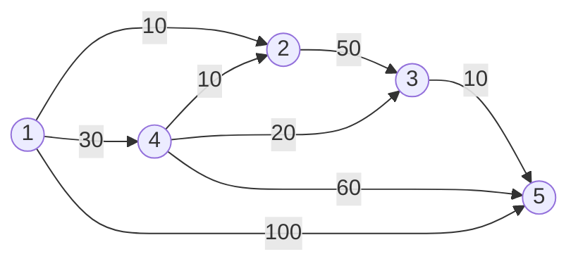
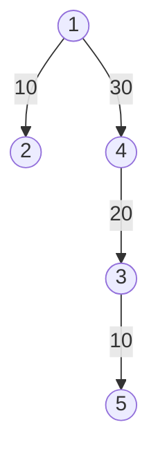

# Estrategia Voraz (Greedy), Mochila, Grafos y Dijkstra

## Algoritmo Greedy (Voraz)

### Características
Un algoritmo voraz consta de los siguientes elementos de diseño:

1. **Conjunto de candidatos:** El conjunto de entrada a partir del cual se construye la solución (por ejemplo, aristas de un grafo, objetos para una mochila, etc.).
2. **Candidatos ya usados:** Registro de los elementos que ya han sido considerados (aceptados o descartados).
3. **Función solución:** Determina si un subconjunto de candidatos constituye una solución completa al problema (sin importar si es óptima o no).
4. **Criterio de viabilidad:** Determina si un conjunto de candidatos seleccionados puede ser extendido de forma que se alcance una solución válida (no necesariamente óptima).
5. **Función de selección:** Determina en cada paso cuál es el candidato no usado más prometedor de acuerdo con una métrica local.
6. **Función objetivo:** Asocia un valor numérico a cada solución (es la función de coste o beneficio que se intenta optimizar). En ocasiones, la métrica de selección coincide con la de la función objetivo de forma directa o indirecta.

---

### Procedimiento General
El esquema genérico de un algoritmo voraz sigue el siguiente flujo de ejecución:

1. Se inicializa el conjunto solución vacío: 
   $$S = \emptyset$$
2. Mientras no se haya alcanzado una solución y queden candidatos por procesar:
   - Se selecciona el mejor candidato posible de la lista utilizando la *función de selección*.
3. Se verifica si añadir este elemento al conjunto actual sigue cumpliendo el *criterio de viabilidad*.
4. Si el candidato es viable, se añade a la solución $S$. Si no es válido (inviable), se descarta permanentemente de la lista de candidatos.
5. Se evalúa la *función objetivo*. Si se alcanza el óptimo o se agotan las posibilidades, el algoritmo finaliza; en caso contrario, se vuelve al **paso 2**.

---

### Problema de la Mochila Booleana (0/1 Knapsack)
En esta variante del problema de la mochila, los objetos no pueden ser fraccionados; o bien se toman por completo, o bien se descartan.

- **Criterio de parada:** Iremos insertando objetos en la mochila hasta alcanzar la capacidad máxima permisible, quedarnos sin candidatos, o hasta que el siguiente candidato viable exceda el límite de peso restante.
- **Estrategia Voraz:** Ordenamos la lista de objetos en orden descendente según su relación de eficiencia o beneficio relativo:
  $$\text{Eficiencia} = \frac{\text{Precio}}{\text{Peso}}$$

---

### Problema de la Mochila Fraccional
En esta variante se permite tomar fracciones de los objetos disponibles.

- **Procedimiento:** Sigue el mismo esquema de ordenación que la mochila booleana (de mayor a menor relación beneficio/peso).
- **Estrategia Voraz:** Si tras procesar los elementos de forma voraz aún queda espacio disponible en la mochila (y el siguiente objeto candidato excede dicho espacio restante), se toma una fracción del objeto para agotar exactamente la capacidad total restante de la mochila, optimizando así el beneficio total obtenido.

---

## Problema del Coloreo de un Grafo

El objetivo es asignar el mínimo número de colores a los vértices de un grafo de manera que no haya dos vértices adyacentes con el mismo color.

### Pasos del Algoritmo:
1. Elegimos un vértice no coloreado y un color de nuestra paleta.
2. Pintamos el vértice elegido con dicho color.
3. Buscamos otro vértice que aún no haya sido coloreado. Si este **no es adyacente** a ningún otro vértice ya coloreado con el color actual, lo coloreamos con este mismo color.
4. Repetimos el proceso hasta que no se puedan colorear más vértices con el color actual. En ese momento, seleccionamos un nuevo color y volvemos al paso 1 con los vértices restantes.

---

## Problema del Viajante de Comercio (TSP)

Consiste en encontrar el **camino hamiltoniano minimal** (o circuito hamiltoniano con la característica de que la suma de los pesos de las aristas recorridas sea mínima) sobre un grafo ponderado. Es decir, visitar todos los vértices exactamente una vez y regresar al punto de partida minimizando el coste total.

---

## Problema del Árbol Generador Mínimo (MST)

Dado un grafo conexo y no dirigido con pesos en las aristas, un árbol generador mínimo es un subconjunto de aristas que conecta todos los vértices sin ciclos y con el mínimo peso total posible.

### Algoritmo de Kruskal
1. Ordenar todas las aristas del grafo en orden ascendente según su peso.
2. Seleccionar las aristas en dicho orden siempre y cuando **no generen ciclos** con las aristas ya seleccionadas.
3. El proceso finaliza cuando hayamos seleccionado exactamente $|V| - 1$ aristas (donde $V$ es el conjunto de vértices).

> **Complejidad Temporal:** Para un grafo de $n$ vértices, el tiempo de ejecución es $O(n \log n)$ debido principalmente al coste de ordenación de las aristas.

---

### Algoritmo de Prim
1. Se parte de un vértice inicial cualquiera del grafo como nodo de inicio del árbol.
2. De todas las aristas que conectan los nodos ya seleccionados con los nodos aún no seleccionados, se escoge la arista de **menor peso**.
3. Se añade el nuevo nodo al árbol y se repite el proceso de forma iterativa actualizando las conexiones candidatas hasta haber incluido todos los vértices.

---

## Problema del Camino Mínimo

### Algoritmo de Dijkstra

Se utiliza para encontrar los caminos más cortos desde un único vértice origen al resto de vértices del grafo (con pesos no negativos).

#### Grafo de Entrada para la Traza:

#### Traza de Ejecución paso a paso:

A continuación se muestra la evolución del conjunto de vértices resueltos $S$ y las distancias mínimas estimadas $D[i]$ a cada nodo $i$:

| Iteración | $S$ | $D[2]$ | $D[3]$ | $D[4]$ | $D[5]$ |
| :---: | :--- | :---: | :---: | :---: | :---: |
| **0** | $\{1\}$ | <u>10</u> | $\infty$ | 30 | 100 |
| **1** | $\{1, 2\}$ | 10 | 60 | <u>30</u> | 100 |
| **2** | $\{1, 2, 4\}$ | 10 | <u>50</u> | 30 | 90 |
| **3** | $\{1, 2, 4, 3\}$ | 10 | 50 | 30 | <u>60</u> |
| **4** | $\{1, 2, 4, 3, 5\}$ | 10 | 50 | 30 | 60 |

> **Notas explicativas sobre la traza:**
> 1. Partimos desde el vértice origen indicado ($1$) y evaluamos sus conexiones salientes directas.
> 2. En cada paso, la distancia menor calculada (marcada con <u>subrayado</u> en la tabla) se fija de manera definitiva y se añade su correspondiente vértice al conjunto solución $S$.

#### Árbol de Caminos Mínimos Resultante:

El grafo simplificado con las aristas finales que definen las distancias óptimas desde el nodo de partida $1$ queda estructurado de la siguiente forma:

