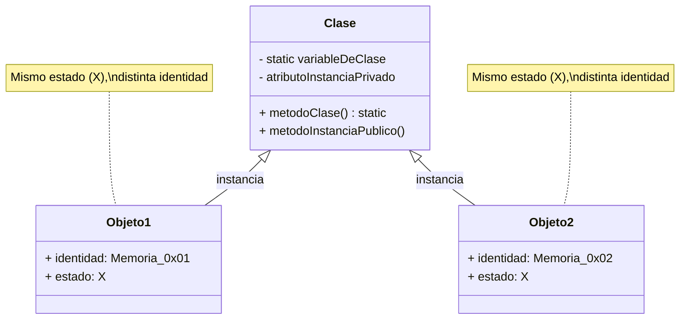

# Cuestionario de Teoría y Conceptos Fundamentales de PDOO

Este documento recopila y formaliza las cuestiones teóricas fundamentales de la asignatura **Programación y Diseño Orientado a Objetos (PDOO)**, estructuradas en formato de cuestionario de Verdadero/Falso ($V$/$F$) con sus correspondientes justificaciones técnicas basadas en los lenguajes de referencia **Java** y **Ruby**.

---

### Cuestiones de Teoría y Conceptos de POO

#### 1. Identidad vs. Estado en Objetos
* **Enunciado:** Dos objetos con el mismo estado pueden tener distinta identidad.
* **Respuesta:** **Verdadero ($V$)**
* **Justificación técnica:** 
  En la programación orientada a objetos, la **identidad** es la propiedad intrínseca que distingue a un objeto de cualquier otro, independientemente de su estado actual. Dos objetos pueden tener exactamente los mismos valores en sus atributos (mismo estado), pero residir en posiciones de memoria diferentes (distintas referencias), lo que implica identidades distintas. En Java, esto se evalúa conceptualmente mediante el operador `==` frente al método `equals()`.

---

#### 2. Variables de Clase y Visibilidad Estática
* **Enunciado:** Si hay mil objetos de una clase $X$, habrá mil copias de su variable de clase.
* **Respuesta:** **Falso ($F$)**
* **Justificación técnica:** 
  Una **variable de clase** (marcada con `static` en Java o como variable de clase `@` / `@@` en Ruby) pertenece a la clase en sí misma y no a las instancias individuales. Por lo tanto, independientemente de que se creen cero, mil o un millón de objetos de la clase $X$, **solo existe una única copia** de la variable de clase compartida por todas las instancias.

---

#### 3. Instanciación en Java (Operador `new`)
* **Enunciado:** El código `MuertoViviente vampiro;` crea en Java un objeto de la clase `MuertoViviente`.
* **Respuesta:** **Falso ($F$)**
* **Justificación técnica:** 
  Esta instrucción únicamente declara una **variable de referencia** (de tipo `MuertoViviente`), cuyo valor inicial por defecto es `null`. No se reserva memoria para el objeto en el montón (*heap*). Para crear efectivamente la instancia y asignarla a la variable, es obligatorio invocar explícitamente el operador de instanciación junto con el constructor: `MuertoViviente vampiro = new MuertoViviente();`.

---

#### 4. Constructores de Atributos en Ruby (`attr_writer`)
* **Enunciado:** El código `attr_writer :color` crea el consultor y el modificador del atributo `color` en Ruby.
* **Respuesta:** **Falso ($F$)**
* **Justificación técnica:** 
  En Ruby, la directiva `attr_writer` crea **exclusivamente el método modificador** (*setter*, es decir, `color=`), permitiendo alterar el valor de la variable de instancia. Para crear tanto el consultor (*getter*) como el modificador de forma simultánea se debe utilizar `attr_accessor`, mientras que `attr_reader` crea únicamente el consultor.

---

#### 5. Visibilidad por Defecto en Métodos y Atributos de Instancia en Ruby
* **Enunciado:** En Ruby, los métodos de instancia son públicos y los atributos de instancia son privados, por defecto.
* **Respuesta:** **Verdadero ($V$)**
* **Justificación técnica:** 
  Por diseño en Ruby, todos los métodos definidos fuera de una cláusula de control de visibilidad (`private` o `protected`) son **públicos** por defecto (con la excepción de `initialize`). Por otro lado, las variables de instancia (atributos) son intrínsecamente **privadas** a la propia instancia y nunca se puede acceder a ellas directamente desde el exterior de la clase sin un método consultor explícito o métodos auxiliares como `attr_reader`.

---

#### 6. Fundamentos de la Identidad en PDOO
* **Enunciado:** La identidad de un objeto en PDOO la da su dirección de memoria.
* **Respuesta:** **Verdadero ($V$)**
* **Justificación técnica:** 
  Desde una perspectiva de implementación a nivel de sistemas y en los modelos de objetos estándar (como los soportados por máquinas virtuales tipo JVM), la **identidad única** de un objeto se fundamenta y se representa unívocamente mediante la referencia o **dirección de memoria** donde reside dicho objeto en el *heap*.

---

#### 7. Constructores y Retorno en Java
* **Enunciado:** Los constructores por defecto devuelven `void`.
* **Respuesta:** **Falso ($F$)**
* **Justificación técnica:** 
  Los constructores sintácticamente **no devuelven ningún tipo de dato**, ni siquiera `void`. Su propósito exclusivo es inicializar el estado del objeto recién creado y su firma carece de cualquier declaración de tipo de retorno.

---

#### 8. Encapsulación y Ocultamiento
* **Enunciado:** La encapsulación de un conjunto de elementos implica de forma implícita su ocultamiento para el resto de elementos del sistema.
* **Respuesta:** **Falso ($F$)**
* **Justificación técnica:** 
  La **encapsulación** consiste en empaquetar datos y los métodos que operan sobre ellos dentro de una misma unidad (la clase). Aunque a menudo se combina con el ocultamiento de información (*information hiding*) para restringir el acceso mediante visibilidades como `private`, la encapsulación en sí misma no implica obligatoriamente que todos los elementos deban estar ocultos; un elemento encapsulado puede ser perfectamente `public`.

---

#### 9. Definición de Clases: Estado y Comportamiento
* **Enunciado:** Cuando definimos una clase, declaramos el estado y definimos el comportamiento de un conjunto de objetos, y en algunas ocasiones también declaramos estado y/o definimos comportamiento de la propia clase.
* **Respuesta:** **Verdadero ($V$)**
* **Justificación técnica:** 
  Una clase actúa como plantilla o molde. Su propósito primario es definir atributos (estado) y métodos (comportamiento) para las **instancias** que se creen a partir de ella. No obstante, mediante el uso de modificadores estáticos (`static`), también es posible definir variables y métodos de clase que pertenecen a la estructura global de la clase en lugar de a los objetos individuales.

---

#### 10. Visibilidad Explícita y Portabilidad entre Lenguajes
* **Enunciado:** Todos los lenguajes de programación soportan los siguientes atributos de visibilidad de forma explícita para sus atributos: `private`, `public`, `package`.
* **Respuesta:** **Falso ($F$)**
* **Justificación técnica:** 
  El control de visibilidad a nivel de paquete (`package` o acceso de paquete por defecto) es una característica específica del modelo de compilación y organización de **Java**. Lenguajes orientados a objetos como Python, C++ o Ruby manejan esquemas de visibilidad diferentes y no implementan un modificador explícito denominado `package`.

---

#### 11. Invocación de Métodos de Clase
* **Enunciado:** Para invocar a los métodos de clase no es necesario que exista previamente una instancia de dicha clase en el sistema.
* **Respuesta:** **Verdadero ($V$)**
* **Justificación técnica:** 
  Los métodos de clase (estáticos) están asociados al ámbito de la clase y no al de ninguna instancia particular. Por tanto, pueden ser invocados directamente utilizando el nombre de la clase (por ejemplo, `Clase.metodoEstatico()`) sin necesidad de instanciar ningún objeto previo mediante `new`.

---

#### 12. Modularidad y Paquetes
* **Enunciado:** Los paquetes son específicos de Java.
* **Respuesta:** **Verdadero ($V$)**
* **Justificación técnica:** 
  El concepto formal de **paquete** (*package*) como mecanismo de estructuración de nombres y control de visibilidad a nivel de espacio de nombres jerárquico es un constructo nativo y específico del ecosistema **Java** (aunque otros lenguajes utilicen conceptos equivalentes como *namespaces* en C++ o módulos en Ruby).

---

### Resumen Conceptual de Relaciones en POO

