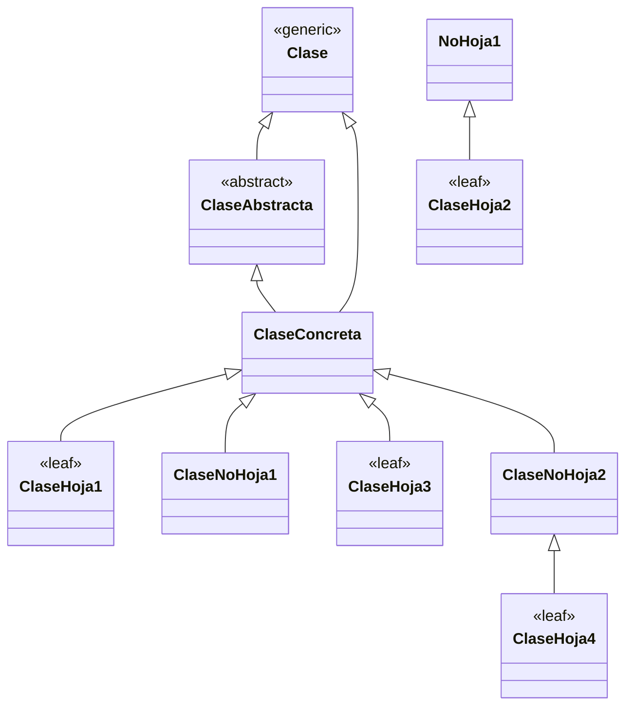

# Jerarquía y Taxonomía de Clases en Java (UML)

**Autor:** Checa Casas, Francisco Javier  
**Asignatura:** Programación y Diseño Orientado a Objetos (PDOO) / Ingeniería del Software  
**Institución:** ETSIIT, Universidad de Granada  

---

## 1. Diagrama de Jerarquía y Taxonomía de Clases

A continuación se representa la jerarquía y taxonomía de clases modelada en notación UML, clasificando los distintos tipos de clases según su abstracción y relaciones de herencia:



---

## 2. Definiciones Conceptuales y Taxonomía

En el contexto del modelado orientado a objetos y lenguajes como Java y Ruby, se definen los siguientes conceptos fundamentales representados en los apuntes:

* **Clase (`Clase`):** Representa la entidad genérica o raíz dentro del sistema de tipos en Java (como la clase `Object`). Define el comportamiento y estado base heredado por defecto.
* **Clase Abstracta (`Clase Abstracta`):** Una especialización de clase que **no se puede instanciar directamente** (`new`) y está destinada a ser una clase base para otras clases. Puede contener métodos abstractos (sin implementación) que las subclases concretas están obligadas a implementar.
* **Clase Concreta (`Clase Concreta`):** Una clase normal que puede ser instanciada directamente y puede derivar tanto de una clase abstracta como directamente de una clase base general.
* **Clase Hoja (`Clase Hoja`):** Es una clase concreta que **no tiene subclases** (es decir, ningún otra clase hereda de ella en el modelo actual). Representa los nodos terminales de la jerarquía de herencia.
* **Clase No Hoja (`Clase No Hoja`):** Es una clase concreta (o abstracta) que **tiene una o más subclases** directas o indirectas, actuando como nodo intermedio en la jerarquía de herencia.

---

## 3. Ejemplo de Implementación en Java

A continuación se muestra un ejemplo básico en Java que refleja la estructura de clases abstractas, concretas, hojas y no hojas:

```java
// Clase base genérica
public class Clase {
    // Atributos y métodos comunes
}

// Clase abstracta (nodo intermedio)
public abstract class ClaseAbstracta extends Clase {
    public abstract void operacionAbstracta();
}

// Clase concreta No Hoja (tiene subclases)
public class ClaseNoHoja extends ClaseAbstracta {
    @Override
    public void operacionAbstracta() {
        System.out.println("Implementación en ClaseNoHoja");
    }
}

// Clase concreta Hoja (no tiene subclases, uso de 'final' opcional para restringir herencia)
public final class ClaseHoja extends ClaseNoHoja {
    @Override
    public void operacionAbstracta() {
        System.out.println("Implementación final en ClaseHoja");
    }
}
```

---

## 4. Equivalente en Ruby

En Ruby, el concepto de clases abstractas no existe de manera nativa mediante palabras reservadas (como `abstract` en Java), pero se simula levantando excepciones si se intenta instanciar directamente o invocar métodos no implementados:

```ruby
# Clase base genérica
class Clase
end

# Simulación de Clase Abstracta
class ClaseAbstracta < Clase
  def initialize
    raise NotImplementedError, "No se puede instanciar una clase abstracta directamente"
  end

  def operacion_abstracta
    raise NotImplementedError, "Debe ser implementada por la subclase"
  end
end

# Clase Concreta No Hoja
class ClaseNoHoja < ClaseAbstracta
  def initialize
    # Permite instanciación si es concreta intermedia
  end

  def operacion_abstracta
    puts "Implementación en ClaseNoHoja"
  end
end

# Clase Concreta Hoja
class ClaseHoja < ClaseNoHoja
  def operacion_abstracta
    puts "Implementación final en ClaseHoja"
  end
end
```